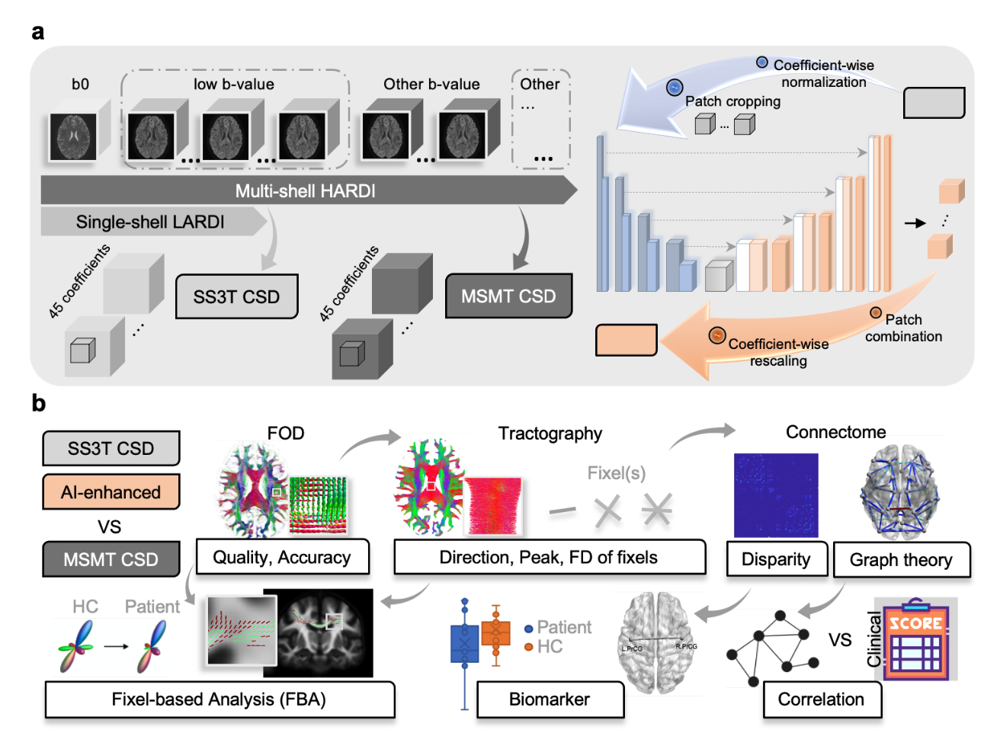

# 🧠 From Promise to Practical Reality: Transforming Diffusion MRI Analysis with Fast Deep Learning Enhancement


>
> [Xinyi Wang](https://scholar.google.com/citations?user=_uPPBqUAAAAJ&hl=en), [Michael Barnett](https://scholar.google.com.au/citations?user=iZVWDzwAAAAJ&hl=en), [Frederique Boonstra](https://scholar.google.com.au/citations?user=xHxerDoAAAAJ&hl=en&oi=ao), [Yael Barnett](https://scholar.google.com.au/citations?hl=en&user=TVSkAYsAAAAJ), [Mariano Cabezas](https://scholar.google.com.au/citations?hl=en&user=zPs-kAkAAAAJ&view_op=list_works&sortby=pubdate), [Arkiev D'Souza](https://scholar.google.com.au/citations?user=eqO2au8AAAAJ&hl=en&oi=ao), [Matthew C. Kiernan](https://scholar.google.com.au/citations?user=J7M4CGMAAAAJ&hl=en&oi=ao), Kain Kyle, [Meng Law](https://scholar.google.com.au/citations?user=lKi-yTMAAAAJ&hl=en&oi=ao), Lynette Masters, [Zihao Tang](https://scholar.google.com.au/citations?user=JAfD8moAAAAJ&hl=en&oi=ao), [Stephen Tisch](https://scholar.google.com.au/citations?hl=en&user=hnKJB1YAAAAJ), [Sicong Tu](https://scholar.google.com.au/citations?hl=en&user=z44EzHAAAAAJ), [Anneke Van Der Walt](https://scholar.google.com.au/citations?hl=en&user=F3AJeqQAAAAJ), [Dongang Wang](https://scholar.google.com.au/citations?hl=en&user=Rs7zEZoAAAAJ), [Fernando Calamante](https://scholar.google.com.au/citations?user=_6_n0PIAAAAJ&hl=en&oi=ao)\*, [Weidong Cai](https://scholar.google.com.au/citations?hl=en&user=N8qTc2AAAAAJ)\*, [Chenyu Wang](https://scholar.google.com.au/citations?user=mo0AoZAAAAAJ&hl=en&oi=ao)\*
>
\* These authors contributed equally as senior authors.
>
>
> 🔬 **Abstract** 
> Fiber orientation distribution (FOD) is an advanced diffusion MRI modeling technique that represents complex white matter fiber configurations, and a key step for subsequent brain tractography and connectome analysis. Its reliability and accuracy, however, heavily rely on the quality of the MRI acquisition and the subsequent estimation of the FODs at each voxel. Generating reliable FODs from widely available clinical protocols with single-shell and low-angular-resolution acquisitions remains challenging but could potentially be addressed with recent advances in deep learning-based enhancement techniques. Despite advancements, existing methods have predominantly been assessed on healthy subjects, which have proved to be a major hurdle for their clinical adoption. In this work, we validate a newly optimized enhancement framework, FastFOD-Net, across healthy controls and six neurological disorders. 
This accelerated end-to-end deep learning framework enhancing FODs with superior performance and delivering training/inference efficiency for clinical use ($60\times$ faster comparing to its predecessor).
With the most comprehensive clinical evaluation to date, our work demonstrates the potential of FastFOD-Net in accelerating clinical neuroscience research, empowering diffusion MRI analysis for disease differentiation, improving interpretability in connectome applications, and reducing measurement errors to lower sample size requirements. Critically, this work will facilitate the more widespread adoption of, and build clinical trust in, deep learning based methods for diffusion MRI enhancement.  Specifically, FastFOD-Net enables robust analysis of real-world, clinical diffusion MRI data, comparable to that achievable with high-quality research acquisitions.
<!-- >  -->


---

> [[🌐 Project Page]](https://fastfodnet.github.io/)

<p align="center">
  
</p>

---

## 📚 Table of Contents

1. [🔬 Abstract](#-abstract)  
2. [🧼 Data Preprocessing](#-data-preprocessing)  
   - [Denoising](#-data-preprocessing)  
   - [Distortion Correction](#-data-preprocessing)  
   - [FOD Generation](#-data-preprocessing)  
3. [📘 Description of Arguments](#-description-of-arguments)  
4. [🧪 Usage](#-usage)  
   - [🏋️‍♂️ Training](#-training)  
   - [🔍 Inference](#-inference)  
5. [🧪 Evaluation Pipeline](#-evaluation-pipeline)  
   - [📈 FOD Evaluation](#-fod-evaluation)  
     - [FOD Metrics](#-fod-evaluation)  
     - [Example Usage](#-fod-evaluation)  
   - [🧠 Fixel Evaluation](#-fiber-bundle-element-fixel-evaluation)  
     - [Generate Fixels](#-generate-fixels)  
     - [Generate ROIs](#-generate-rois)  
     - [Fixel Metrics](#-fixel-evaluation-metrics)  
     - [Example Usage](#-fixel-evaluation-metrics)  
   - [🌐 Connectome Evaluation](#connectome-evaluation)  
     - [Connectome Construction](#structure-connectome-construction)  
     - [Connectome Metrics](#connectome-metrics)  
     - [Graph Metrics](#graph-metrics)  
     - [Example Usage](#example-usage-1)  
   - [📊 Fixel-based Statistical Analysis](#fixel-based-analysis)  
   - [🧩 Pathological Connection Analysis](#pathological-connection-analysis) *(TBC)*  
   - [🔄 Correlation Analysis](#correlation-analysis) *(TBC)*  
6. [📄 Citation](#-citation)  
7. [🙏 Acknowledgments](#-acknowledgments)  
 

---

## 🧼 Data Preprocessing

- [Denoising](https://mrtrix.readthedocs.io/en/latest/dwi_preprocessing/denoising.html)  
- [Distortion Correction](https://mrtrix.readthedocs.io/en/latest/dwi_preprocessing/dwifslpreproc.html)  
- **FOD Generation:**
  - [Response Estimation](https://mrtrix.readthedocs.io/en/latest/constrained_spherical_deconvolution/response_function_estimation.html)
  - [SS3T CSD](https://mrtrix.readthedocs.io/en/latest/constrained_spherical_deconvolution/constrained_spherical_deconvolution.html)
  - [MSMT CSD](https://mrtrix.readthedocs.io/en/latest/constrained_spherical_deconvolution/multi_shell_multi_tissue_csd.html)
  
[🔝 Back to Table of Contents](#-table-of-contents)

---

## 📘 Description of Arguments

| Argument                     | Description                                                    |
| ---------------------------- | -------------------------------------------------------------- |
| `--dataroot`                 | Path to low-resolution FOD input data.                         |
| `--maskroot`                 | Path to brain mask files.                                      |
| `--gtroot`                   | Path to high-resolution ground truth FODs.                     |
| `--checkpoints_dir`          | Directory to save model checkpoints.                           |
| `--name`                     | Experiment name, used to label checkpoint folder.              |
| `--normalization_mode`       | Normalization strategy (e.g., z-score based).                  |
| `--model`                    | Model type; `re` refers to resolution enhancement.             |
| `--input_nc` / `--output_nc` | Number of channels (e.g., 45 SH coefficients).                 |
| `--init_type`                | Weight initialization method (`kaiming`, etc).                 |
| `--dataset_mode`             | Dataset loader mode (`fod_re` for FOD resolution enhancement). |
| `--num_threads`              | Number of data loading threads.                                |
| `--batch_size`               | Batch size for training.                                       |
| `--beta1`                    | Beta1 for Adam optimizer.                                      |
| `--lr`                       | Initial learning rate.                                         |
| `--n_epochs`                 | Number of training epochs.                                     |
| `--print_freq`               | Print frequency (in iterations).                               |
| `--save_latest_freq`         | Frequency (in iterations) to save latest checkpoint.           |
| `--save_epoch_freq`          | Frequency (in epochs) to save checkpoints.                     |
| `--gpu_ids`                  | GPU to use (e.g., `0` for first GPU).                          |
| `--conv_type`                | Network architecture; here using `fastfodnet`.                 |
| `--test_fold`                | Index of fold used for testing (for cross-validation).         |
| `--phase`                    | Run phase: `train` or `splitfolds` (for k-fold split).         |
| `--index_pattern`            | Regex pattern to match subject IDs.                            |
| `--sample_suffix`            | File suffix for low-res FODs.                                  |
| `--sample_gt_suffix`         | File suffix for ground truth FODs.                             |
| `--foldroot`                 | Directory containing train/test splits.                        |

[🔝 Back to Table of Contents](#-table-of-contents)

---

## Basic Usages
### 🏋️‍♂️ Training
To start training FastFOD-Net using predefined parameters (e.g., for the MSBIR dataset), run:
```
cd ./CORE/scripts/
sh train_msbir.sh
```
- This script wraps a python train_model.py command with the appropriate dataset, fold, and model settings.
- 📝 Be sure to modify `train_msbir.sh` if you're working with a different dataset or configuration.

### 🔍 Inference
To perform inference on a trained model:
```
cd /scripts/
sh test_msbir.sh
```
- `test.sh` should call test_model.py or equivalent with correct model checkpoint and dataset paths.
- 📝 Ensure the --phase is set to test or similar.

[🔝 Back to Table of Contents](#-table-of-contents)

---
## 🧪 Evaluation Pipeline

This pipeline provides tools for evaluating the performance of Fibre Orientation Distribution enhancement methods using a set of quantitative metrics from different perspectives.

---
### 📈 FOD Evaluation
The following metrics are computed in `evaluation_fod.py`:
- **MSE**: Mean Squared Error   
- **PSNR**: Peak Signal-to-Noise Ratio  
- **$r_{\text{Angular}}$**: Angular correlation coefficient
  
#### 🔧 Example Usage
To run FOD evaluation:
```
cd ./evaluation
python run_fod_metrics.py
```
[🔝 Back to Table of Contents](#-table-of-contents)

---
### 🧠 Fiber Bundle Element ("Fixel") Evaluation

This module evaluates fiber-specific metrics derived from fixel-based analysis.

#### 🛠 Generate Fixels

To generate fixel data from FOD images:
```
cd ./evaluation
python generate_fixel.py
```
 
#### 🛠 Generate ROIs

Bundle-wise ROIs can be generated using [TractSeg](https://github.com/MIC-DKFZ/TractSeg), a tool for white matter tract segmentation.

We define regions with different fiber complexities using the following bundles:

- **Single-fiber region:**  
  - `CC` (Corpus Callosum)

- **Two-crossing-fiber regions:**  
  - `MCP` (Middle Cerebellar Peduncle)  
  - `CST` (Corticospinal Tract)

- **Three-crossing-fiber regions:**  
  - `SLF` (Superior Longitudinal Fasciculus)  
  - `CST`  
  - `CC`

🔍 *See* `./evaluation/generate_fixel_roi.py` for an example of how to generate these ROIs using results from TractSeg.*

#### 📊 Fixel Evaluation Metrics

This module performs evaluation on fixel-based metrics after fixel-wise matching between methods. Implemented in `evaluation_fixel.py`, the following metrics are computed:

- **$E_{Angular}$**: Angular error between matched fixels  
- **$E_{FD}$**: Error in Fixel Density (FD)  
- **$E_{Peak}$**: Error in Peak

#### 🔧 Example Usage

Run the full fixel evaluation pipeline:
```
cd ./evaluation
python run_fixel_metrics.py
```
[🔝 Back to Table of Contents](#-table-of-contents)

---

### Connectome evaluation

#### 🛠 [Structure Connectome Construction](https://mrtrix.readthedocs.io/en/latest/quantitative_structural_connectivity/structural_connectome.html)
1. Get a parcellation image with [FastSurfer](https://github.com/Deep-MI/FastSurfer) using [Desikan-Killiany Atlas 84](file:///Users/xinyiwang/Downloads/jnnp-2021-328185-inline-supplementary-material-1.pdf)
2. [Anatomically-Constrained Tractography (ACT)](https://mrtrix.readthedocs.io/en/latest/quantitative_structural_connectivity/act.html)
3. [Spherical-deconvolution Informed Filtering of Tractograms (SIFT)](https://mrtrix.readthedocs.io/en/latest/quantitative_structural_connectivity/sift.html)

#### 🛠 Connectome Metrics

We evaluate structural connectomes using the following metrics:

- **Disparity**: Quantifies variability in edge weights within the connectome.
- **Number of significantly different edges**: Counts edges with statistically significant differences across methods.

📁 See implementation: [`./evaluation/connectome.py`](./evaluation/connectome.py)

#### 🛠 Graph Metrics

We treat the connectome as a graph and compute higher-order network properties inspired by:

- MATLAB recommended: **[Brain Connectivity Toolbox (BCT)](https://sites.google.com/site/bctnet/)**  
- Python implementation: [`./evaluation/graph_metrics.py`](./evaluation/graph_metrics.py)

#### 📈 Example Usage

To run the full pipeline of connectome and graph metric evaluation:

```bash
cd ./evaluation
python run_connectome_metrics.py
```

#### Connectome Visualization
TBC

[🔝 Back to Table of Contents](#-table-of-contents)

---

### Fixel-based analysis
TBC
Compare patient-control differences post-enhancement
1. [Fixel-based analysis for MSMT CSD](https://mrtrix.readthedocs.io/en/latest/fixel_based_analysis/st_fibre_density_cross-section.html)
2. Register pre-enhancement, post-enhancement results all to the reference (i.e., MSMT CSD) template space
3. Fixel matching and stats in [`./evaluation/evaluaation_fixel.py`](./evaluation/graph_metrics.py) between methods for comparision

[🔝 Back to Table of Contents](#-table-of-contents)

---

### Pathological connection analysis
TBC

[🔝 Back to Table of Contents](#-table-of-contents)

---
### Correlation analysis
TBC

[🔝 Back to Table of Contents](#-table-of-contents)

---
## 📝 Citation
If you find our data or project useful in your research, please cite:
```
TBC
@inproceedings{
}
```
---
#### 🤝 Acknowledgments
This repo. template was borrowed from [Chaoyi Zhang's Project](https://github.com/chaoyivision/SGGpoint). 

